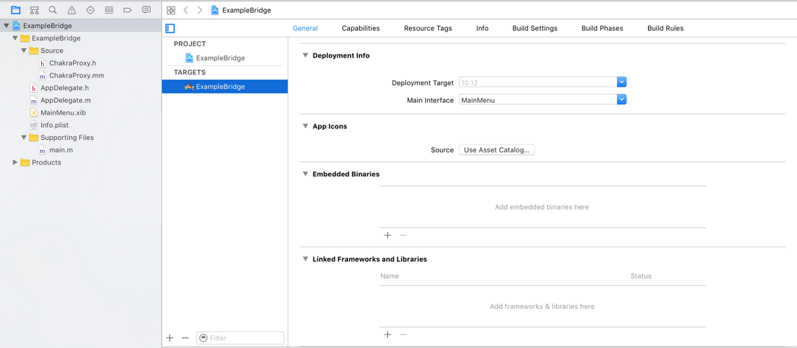
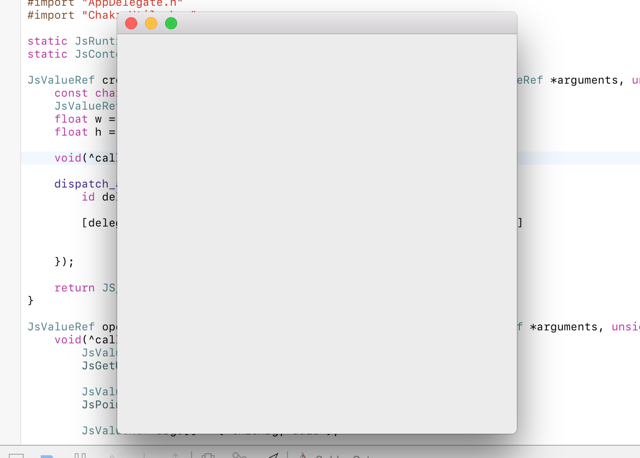

原文地址：https://medium.com/@kureevalexey/how-to-create-your-own-native-bridge-bfa050e708fc#.ykryuzmun


What do you know about JavaScript engines? Did you ever try to embed one? In this chapter I’m going to guide you through the dark spooky forest of hosted objects, virtual machines, interpreters and other evil spirits that we call JavaScript engines.

你之前对 JS 引擎是否有过了解？有没有试着在自己的项目里面嵌入一个 JS 引擎玩玩儿？在这篇文章里面，我会给你一些指引，以便可以顺利通过含有 Hosted Objects, Virtual Machines, Interpreters 以及一些其它稀奇古怪玩意儿的『魔法森林』。（*不太准确*）

I know that it may look scary, but don’t forget that a journey of a thousand miles starts with a single step. In our case it’ll be a step into code parsing. At this stage our JavaScript source is getting converted to a structure called abstract syntax tree (AST). There are many different techniques to parse your code (LL(k), LR(k) etc) and convert it to AST, but for the sake of simplicity I want to keep it out of this article.

我知道这听起来很疯狂，不过我们要牢记『千里之行，始于足下』。对我们来说，第一步就是代码解析，也就是把原始的 JS 代码转化成抽象语法树（AST）的表示形式。业界已经有很多不同的方案可以把原始代码转化成抽象语法树，例如 LL(k), LR(k) 等等，不够为了简单起见，这篇文章里面我不会涉及相关的内容。

<!-- more -->

> Although, for those who are interested, I got all my knowledge about parsers (and compiler theory in general) from the Dragon Book. I just can’t recommend it enough.
> 不过对于感兴趣的读者，我所有对解析器编译器的知识都是来自传说中的那本『龙书』。
> I just can’t recommend it enough. (*如何翻译*)

However, I will tell you more about the abstract syntax tree concept. An AST is a structural representation of your code in a tree format where every node represents a language construct (e.g. expressions, statements, variables, literals etc). You can play with it using ESPrima praser demo page or ASTExplorer.
尽管如此，我还是想对 AST 多说一句。简单来说 AST 是代码另外一种结构化的表达形式，树中的每个节点可以表达编程语言中一种构型(*不太准确*)，比如：表达式，语句，变量，字面量等等。你可以借助 ESPrima 或者 ASTExplorer 来直观的看到 AST 的表达形式。


First of all, a JavaScript engine has to parse (tokenize) a source code to produce an array of tokens. These tokens are supplied to a syntactic analysis tool that builds an AST based on a given language grammar. Once an AST is built, JavaScript engine will compile it either to machine code directly (V8 behaves this way) or to intermediate representation, which is an another level of abstraction over machine code.

首先，JS 引擎会把我们的代码进行词法解析，得到一组 Token，之后这些 Token 会交给语法分析器来构造抽象语法树（AST）。一旦抽象语法树（AST）构造成功之后，JS 引擎就会直接把它编译成机器码（比如 V8 就是这么做的）或者转化成 IR 的表达形式（也就是机器码只上的另外一种抽象形式）

In this experiment I committed to use ChakraCore which uses a bytecode as it’s intermediate language. But it can’t be executed straight away: our target machine doesn’t know how to process it.

在我们使用的 ChakraCore 中，它的 IR 表达形式是字节码，但是字节码无法被直接执行，最终还是需要被转化成机器码才可以。


In order to bridge the gap, ChakraCore includes a bytecode interpreter. On ChakraCore’s bytecode each instruction starts with a 1-byte bytecode that represents which operation should be executed (a.k.a. opcode), and therefore the interpreter may have up to 256 instructions. Some bytecodes may take multiple bytes, and may be arbitrarily complicated

为了能够执行字节码，ChakraCore （很多其它 JS 引擎）引入了字节码解释器。ChakraCore 设计字节码指令的时候，开始的第一个字节用来定义应该执行何种操作（也就是常说的 `opcode`），然后解释器可以执行最多 256 个指令。有些指令操作可能需要多个字节才能够表达，而且可能异常复杂（*不太准确*）


That was a very short overview of the JS execution flow. Probably you noticed that in this article we don’t talk about inner code optimizations (like JIT or AoT). Although it’s a very interesting topic, I decided to omit it in order to make this article easier to grasp.

上述内容就是关于 JS 引擎如何执行 JS 的一个简单介绍，这里面并没有涉及到一些代码优化方面的内容（比如 JIT 或者 AoT 之类的技术），尽管如此，这也是一个很有意思的课题，不过我还是决定尽快结束这部分的内容，以便可以进入正题。

## Embedding ChakraCore
## 准备嵌入 ChakraCore

Now, when we have some knowledge about ChakraCore, we can start embedding it into our application. So first of all we need to install ChakraCore dependencies:

到现在为止，我们对 ChakraCore 已经有了基本的了解，所以要着手把它嵌入到我们的 Cocoa 应用中去了。
第一步要做的事情是安装相关的依赖，以便可以把 ChakraCore 编译出来：

```bash
$ xcode-select --install
$ brew install cmake icu4c
```

And ChakraCore itself. I will show how to include it as a submodule:
然后获取 ChakraCore 的源代码，并且把它设置成我们项目的一个子模块（其实不是必须的，只是为了方便起见）：

```bash
$ mkdir modules && $_
$ git submodule add https://github.com/Microsoft/ChakraCore
```

Then build it from the source:
最后执行如下命令来编译源码：

```bash
$ cd ChakraCore
$ ./build.sh --static --icu=/usr/local/Cellar/icu4c/<version>/include --test-build -j=2
```

Once these steps are done, we can include it into our application:
如果一切顺利的话，我们就可以在前一篇文章里面提到的项目中引用编译的产物了：

1. Open the project we created in the previous chapter
1. 用 XCode 打开前一篇文章里面提到的项目
2. Select ExampleBridge project in the Project navigator and switch to the target:
2. 选择 ExampleBridge 项目，然后在项目属性中切换到 `target` 配置项目：



Link your compiled ChakraCore files:
链接一下 ChakraCore 的编译产物：

* libChakra.Pal.a
* libChakra.Common.Core.a
* libChakra.Jsrt.a

And your icu4u files (from /usr/local/Cellar/icu4c/<version>/include):
以及 icu4u 的几个库文件（地址是 /usr/local/Cellar/icu4c/<version>/include）：

* libicudata.a
* libicui18n.a
* libicuuc.a

Your result should look like this:
最终的结果看起应该是这样子的：


> Note: order of these dependencies is very important!
> 注意：链接库的顺序很重要，别弄错了！

## Getting started with ChakraCore
## 开始使用 ChakraCore

We come to the very interesting part of our journey. To the place where we need all our knowledge about JavaScript engines and the way they work. Yes, dear reader, you’re right! We’re about to start using ChakraCore!
终于开始介绍最有意思的部分了，为了能理解后续的内容，我们需要前面的背景知识以便对 JS 引擎的工作原理有一个基本的了解。幸运的是，我们做到了，下面就开始介绍如何来使用 ChakraCore。

### Bootstrapping ChakraCore
### 初始化 ChakraCore

First of all, open your ChakraProxy.m file and find the NSLog statement that we added in the previous chapter. Let’s replace it by something that makes more sense:
首先，打开 `ChakraProxy.m` 文件找到 `NSLog` 这一行，然后把它替换成下面的几句：

```
@implementation ChakraProxy

-(void)run {
    unsigned currentSourceContext = 0;
    
    NSString *filepath = [[NSBundle mainBundle] pathForResource:@"main" ofType:@"js"];
    NSError *error;
    NSString *fileContents = [NSString stringWithContentsOfFile:filepath encoding:NSUTF8StringEncoding error:&error];
    
    if (error) {
        NSLog(@"Error reading file: %@", error.localizedDescription);
    }
    
    const char *script = [fileContents cStringUsingEncoding:NSASCIIStringEncoding];
    
    // Create a runtime
    JsCreateRuntime(JsRuntimeAttributeNone, nullptr, &runtime);
    
    // Create a context
    JsCreateContext(runtime, &context);
    JsSetCurrentContext(context);
    
    // Run script
    JsRunScriptUtf8(script, currentSourceContext++, "", nullptr);
}

@end
```

I don’t expect you to be familiar with Objective C, so let me guide you through this code:
我不指望你对 Objective C 能有多熟悉，所以还是需要简单的介绍一下上面的代码是做啥的：

* Line 6–8: Read a content of main.js file from the bundle. [More about bundles here](https://developer.apple.com/reference/foundation/bundle).
* 第 6 行 - 第 8 行：从 [Bundle](https://developer.apple.com/reference/foundation/bundle) 里面读取 main.js 的内容。

* Line 14: ChakraCore is an engine, written in C++, so it doesn’t understand NSString format. However, we used Objective C approach to read a file content and now we have to deal with NSString to const char* conversion. So, that’s how we do it.
* 第 14 行：因为 ChakraCore 是 C++ 开发的，它提供的接口不支持 NSString 类型的参数，所以我们通过 Objective C 读取了文件内容之后，还需要把 NSString 类型转化为 const char * 类型，以便可以正常调用 ChakraCore 提供的 API。

* Line 24: That’s my custom C++ function. I use it in order to reduce a cognitive payload of run method and move a function description to the different section of this article.
* 第 24 行：调用自定义的 C++ 函数 `JsRunScriptUtf8`，目的是为了减少 `run` 方法的代码行数，另外也为了后面也可以单独介绍这个函数的实现。

Hope it doesn’t look very complex to you. Anyway, there are still some unclear places in this code:
希望上面的内容没有那么复杂，不过上面的代码里面还是有几个没有澄清的概念：

### Runtime
### 运行时（Runtime）

Runtime (line 17) represents a complete JavaScript execution environment. Each runtime that is created has its own isolated garbage-collected heap and, by default, its own just-in-time (JIT) compiler thread and garbage collector (GC) thread. (see [ChakraCore JSRT overview](https://github.com/Microsoft/ChakraCore/wiki/JavaScript-Runtime-%28JSRT%29-Overview#concepts))
第 17 行的运行时（Runtime）代表的是一个 JS 的执行环境。运行时之间是相互隔离的，每个运行时（Runtime）有自己的 GC 堆栈，自己的 JIT 编译线程 和 GC 垃圾回收线程，更多的内容请参考 [ChakraCore JSRT overview](https://github.com/Microsoft/ChakraCore/wiki/JavaScript-Runtime-%28JSRT%29-Overview#concepts)

### Execution Context
### 执行上下文（Execution Context）

Context (line 20–21) is an execution environment that allows separate, unrelated, JavaScript applications to run in a single instance of runtime. You must explicitly specify the context in which you want any JavaScript code to be run. (see [V8 Embedder’s Guide](https://github.com/v8/v8/wiki/Embedder%27s%20Guide#contexts))

第 20 行 - 第 21 行 的执行上下文（Execution Context）允许在同一个运行时（Runtime）中执行独立的，不相关的 JS 代码。（*不太准确*）当执行 JS 代码的时候，必须显示的声明在哪个执行上下文中去运行。更多的内容请参考[V8 Embedder’s Guide](https://github.com/v8/v8/wiki/Embedder%27s%20Guide#contexts)

### Extending global scope
### 扩展全局对象

Now, when ChakraCore is set up, it’s time to build a bridge. In the previous chapter I briefly mentioned that we’re going to use hosted objects to expose C++ functions to JavaScript. So let’s write a function that will do it for us:
ChakraCore 初始化之后，我们就需要考虑如何把 `bridge` 构造出来。在前一篇文章里面，我简单的提到了使用 `Hosted Object` 来把 C++ 的一些函数暴露给 JS，所以我们考虑通过 `SetupGlobalEnvironment` 来完成这部分工作，代码如下： 

```
JsErrorCode SetupGlobalEnvironment() {
    JsValueRef globalObject;
    JsGetGlobalObject(&globalObject);
    
    JsValueRef bridgeObject;
    JsCreateObject(&bridgeObject);
    
    ChakraUtils::setObjectProperty(globalObject, 'bridge', bridgeObject);
    ChakraUtils::setObjectFunctionProperty(bridgeObject, 'render', render);
    
    return JsNoError;
}
```

If you rewrite the code above to JavaScript, it’ll look like this:
如果用 JS 来实现上面的逻辑，代码可能看起来是这样子的：

```
function SetupGlobalEnvironment() {
  var globalObject = JsGetGlobalObject();
  var bridge = {
    render: render,
  };
  
  globalObject.bridge = bridge;
  return 0;
}
```

As you can see from the snippet above, we use a special ChakraCore function JsGetGlobalObject to get context’s “global” object. Once it is there, we extend it by a custom hosted object called “bridge” to expose our C++ “render” function to JS. This approach is similar to the one we used in our web applications back in a day. I’m talking about namespaces, when you move all your application modules under window.app or a similar object in order to scope them by an organic global variable. In this code we do the same, but instead of modules we expose a custom C++ function. You are probably wondering why in the code above I use ChakraUtils. It’s a self-written wrapper over a standard ChakraCore API. I won’t go though the code, but you can find my implementation on the github.
从上面的代码可以看到，我们调用了 ChakraCore 提供的 JsGetGlobalObject API 来获取执行上下文（Execution Context）中全局 （`global`）对象，然后在它上面添加了一个名字是 `bridge` 的对象，在 `bridge` 这个对象上面通过 C++ 扩展了一个 `render` 的方法，如今在 Web 开发中也大量采用类似的技术。这里我要额外提一下命名空间（namespace），当我们把所有应用的代码都挂到 `window.app` 或者类似一个对象上面的时候，目的是为了使用一个全局对象来控制他们的作用范围（*不太准确*）。另外，你可能有些疑惑，为啥上面会用到 ChakraUtils，实际上它只是封装了一下 ChakraCore 的API，所以这里不会过多的介绍，你可以从我的 github 上面看到它具体的实现。

However, the “render” function is still has to be defined. It should fit a JS function interface and perform an async dispatch to the main thread. The simplest implementation will look like this:
尽管如此，前面提到的 `render` 这个函数还没有实现，我们需要完成这部分工作。它的实现逻辑应该符合 JS 函数的接口，当调用的时候给主线程派发一个异步的操作。最简单的实现代码可能看起来是这样子的：

```cpp
JsValueRef render(JsValueRef callee, bool isConstructCall, JsValueRef *arguments, unsigned short argumentCount, void *callbackState) {    
    NSString *type = [NSString stringWithUTF8String:ChakraUtils::toString(arguments[1])];
    float w {ChakraUtils::toFloat(arguments[2])};
    float h {ChakraUtils::toFloat(arguments[3])};
    
    dispatch_async(dispatch_get_main_queue(), ^{
        id delegate = [[NSApplication sharedApplication] delegate];
                       
        [delegate renderElementOfType:type size:NSMakeSize((CGFloat)w, (CGFloat)h)];
    });
    
    return JS_INVALID_REFERENCE;
}
```

Try to not to be overwhelmed by the amount of function parameters, in this article we’re about to use only one — arguments. The code above will read the first two parameters passed to the function from JavaScript and invoke an Objective-C AppDelegate method called renderElementOfType . No callbacks, no return values. Let’s keep it simple for now.
不要被上面函数参数的数量吓到，实际上在这篇文章里面，我们只用到了一个参数，也就是 `arguments`。上面的代码主要完成的工作是读取 JS 调用 render 函数时候传递的参数，然后调用 Objective C AppDelegate 里面 renderElementOfType 方法传递过去。不需要考虑返回值，不需要考虑回掉函数。

One thing, that may make you feel confused is a dispatch_async call. We use this function in order to schedule a block (statement inside ^{}) to be executed in the main dispatch queue (see [GCD documentation for details](https://developer.apple.com/library/content/documentation/General/Conceptual/ConcurrencyProgrammingGuide/OperationQueues/OperationQueues.html)).
上面代码里面有一个地方可能比较费解，就是 dispatch_async 的调用。我们用这个函数是为了在主线程调度队列里面调度执行一个 block，更多内容请参考[官方的文档](https://developer.apple.com/library/content/documentation/General/Conceptual/ConcurrencyProgrammingGuide/OperationQueues/OperationQueues.html)


Now, once “render” function is invoked, it sends a block to the main thread. Inside the block we have a renderElementOfType call, which is responsible for a final element creation:
现在一旦在 JS 里面调用 render 函数，就会把一个 block 发送到主线程。在这个 block 里面我们调用了 renderElementOfType 方法，然后开始绘制 UI。

```
- (void)renderElementOfType:(NSString *)name size:(NSSize)size {
    GGWindow *window = [[GGWindow alloc] init];
    [window openWithSize:NSMakeSize((CGFloat)size.width, (CGFloat)size.height)];
}
```

You may notice, that we hardcode window and don’t even use a name property. We’ll get back to this part in the third chapter. Other than that, this code should be pretty straight-forward: we create a CGWindow instance and call openWithSize method with a given params.
你可能注意到了，上面 renderElementOfType 函数里面我们对 window 硬编码了，什么还没来得及给它起名字，不过在第三篇文章里面我们还会介绍这部分的内容。除此之外，其它的部分应该很容易理解了，创建了一个 CGWindow 实例，然后调用 openWithSize 方法。

But when you call this function, you don’t see a window. Why? Because window is a local variable and it will be deallocated once you leave the function scope. So in order to see a window, we have to store a reference to this window somewhere outside of the function. Let’s create a UIManager class that will manage our UI references:
不过我们并没有看到窗口出现，为什么呢？因为 window 是一个局部变量，一旦 renderElementOfType 函数执行完毕，window 就会被释放掉了。所以为了能看到创建的窗口，必须把 CGWindow 的实例存在 renderElementOfType 函数之外的某个地方，保证窗口的引用不会被释放。所以我们创建了 UIManager 这个类，来管理所有 UI 的引用，代码如下：

**EBUIManager.h**

```
#import <Foundation/Foundation.h>

@interface EBUIManager : NSObject

+ (instancetype)sharedInstance;
- (void)addValue:(id)value forKey:(NSString *)key;

@end
```

**EBUIManager.m**

```
#import "EBUIManager.h"

@implementation EBUIManager

NSMutableDictionary *registry;

+ (instancetype)sharedInstance {
    static EBUIManager *sharedInstance = nil;
    @synchronized (self) {
        if (!sharedInstance) {
            sharedInstance = [[self alloc] init];
            registry = [NSMutableDictionary new];
        }
    }
    return sharedInstance;
}

- (void)addValue:(id)value forKey:(NSString *)key {
    [registry setValue:value forKey:key];
}

@end
```

You’re probably wondering what does a sharedInstance mean? It’s one of the ways to create a singleton in Objective C. It’s not necessary to make UIManager a singleton, but to me it feels like a right way to do it.
你了能对上面的 sharedInstance 比较疑惑，它到底是干什么的呢？实际上那是在 Objective C 里面创建一个单例的方式，虽然对于 UIManager 来说，单例不是必须的，不过对我来说，让 UIManager 成为单例是一种很直观的方式。

This class has the only one public API method: addValue. In the next chapter I’m going to add some more (like deleteValue), but let’s keep it as simple as possible for now.
UIManager 对外提供了唯一的接口 addValue。在下一章会给 UIManager 添加更多的接口（比如 deleteValue 之类的），不过现在为了简单起见，我们只需要 addValue 这一个接口。

Let’s update our renderElementOfType function to start using our storage:
现在就可以修改一下之前 renderElementOfType 的实现了，需要用 UIManager 来管理一下 CGWindow 的实例：

```
- (void)renderElementOfType:(NSString *)name size:(NSSize)size {
    EBWindow *window = [[EBWindow alloc] init];
    EBUIManager *manager = [EBUIManager sharedInstance];
    [window openWithSize:NSMakeSize((CGFloat)size.width, (CGFloat)size.height)];
    NSString *uuid = [[NSUUID UUID] UUIDString];
    [manager addValue:window forKey:uuid];
}
```

So once we get a UIManager instance, we generate a uuid for our window and put it in the storage by addValue. Inside the manager we generate a strong reference to the given object which prevents it from being deallocated (see ARC).
我们给每个 CGWindow 的实例生成一个 UUID，然后调用 UIManager 的 addValue 方法来保存这些实例的引用。在 UIManager 内部，我们用『强引用』(strong reference)的方式来保存 CGWindow 实例的引用，从而可以避免被释放，更多内容请参考 [ARC 的官方文档](https://en.wikipedia.org/wiki/Automatic_Reference_Counting)

And you know what? That’s it! If you create a main.js file, add it to the bundle and type something like bridge.render('Window', 400, 400);, you’ll see a 400x400 window at the application startup!
好的，结束了，我们现在只需要准备一个 main.js，内容是 `bridge.render('Window', 400, 400)`，然后把它添加到 bundle 里面去，编译，运行整个项目，我们就能看到一个 400x400 的应用窗口出现了。



Buy hey, it has nothing about React yet! What do we need to provide for a React-like interface to our platform? How to return references from Objective-C to JS? All these questions will be answered in the Chapter 3!
不过到这里还没有跟 React 扯上任何关系。如果要运行 React 的应用，在我们的平台上还缺少什么呢？如果把一些引用从 Objective C 返回给 JS 呢？这些问题我们会在第三篇文章里面回答。

In the meanwhile, you can play around with the code from this article.
与此同时，你可以从我们的 github 账户中把[代码](https://github.com/Kureev/ExampleBridge/releases/tag/2.0) checkout 本地测试，运行一下看看效果。