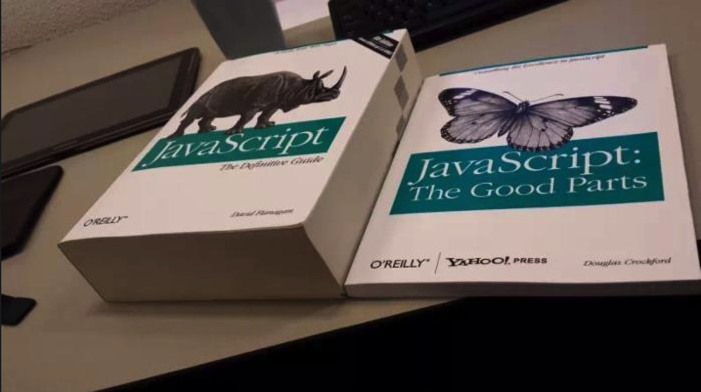

自鸿蒙初判，[Brendan Eich](http://en.wikipedia.org/wiki/Brendan_Eich) 10 天捏出 Mocha 之后，即便进化成 EcmaScript，这个语言依旧毁誉相随。那些经过重重劫难，侥幸渡劫成功的苦主标识了诸多天坑（见 [JavaScript Garden](http://bonsaiden.github.io/JavaScript-Garden/)） —— 当然，你也可以称之 feature。据无责任乱猜，Douglas Crockford 也没少踩坑，于是才有了蝴蝶书《JavaScript: The Good Parts》，下雨天与 `JSLint` 一起使用会更配哟。



《JavaScript: The Definitive Guide》 V.S. 《JavaScript: The Good Parts》

时至今日，代码的静态质量检查在项目质量保障方面的重要性与必要性已毋庸置疑。越来越多的开发者意识到了这一点，纷纷在项目构建流程或者源码控制系统中添加静态检查的 `hook`。本文将依时间顺序，选出 `JavaScript` 史上的主要几个 `Linter` 作横向比较，最终属意谁家，那就见仁见智了。

### [JSLint](http://www.jslint.com/)

`JSLint` 的名字源于早期用于检查 `C` 语言代码质量的 `Lint`，老道把认为非 `Good Parts` 、有陷阱的部分全部报 warning，而且绝不允许妥协（当前版本已经允许部分的可配置项），固执得令人心疼。

虽然这个在 2002 年的 JSLint 代表着先进的方向，但是前端的发展一日千里，严格不妥协的 `JSLint` 开始阻碍前端的发展 —— 例如函数内变量全部集中在顶部定义，推荐一个 `var` 定义多个变量等。最最最重要的是，老道拒绝开源 `JSLint`（无责任乱猜，也许 `JSLint` 的实现代码违反它自己制定的规则）。


截止 2015年6月9日，`JSLint` 仍然在更新，官网上写着 **`JSLint edition 2015-06-02 BETA`**，固执的老道。

### [JSHint](http://jshint.com/)

鉴于 `JSLint` 的现状，[Anton Kovalyov](http://anton.kovalyov.net/) 以 `JSLint` 为蓝本，在社区力量的帮助下实现了开源的 `JSHint`。

相较之下，`JSHint` 更友好，可配置性更高。由于大家受 `JSLint` 的压迫太久，而且得益于开源的优势，风头很快盖过 `JSLint`，一时无两，获得大量 IDE/Editor 的支持。然而成败萧何，`JSHint` 的成功源于对 `JSLint` 的改进，但同样继承了 `JSLint` 的诸多缺点，比如不易扩展，难以根据报错信息定位到具体的规则配置等。虽然有专门的文档说明，但是修复的成本仍旧不低，于是出现了 [ JSLint Error Explanations](http://jslinterrors.com/) 这样的网站，针对 `JSLint/JSHint/ESLint` 报的错误作修复说明 —— “啪啪”，这对 `JSHint` 团队来说无异于打脸。


`JSHint` 团队也逐渐意识到这个问题的重要性，2012 年时曾有 [**讨论**](https://github.com/jshint/jshint/issues/387) 使用 `esprima` 生成 **AST**（见 [jshint-next](https://github.com/jshint/jshint-next)，提示该项目已过期，已 merge 到主项目，但在 2013/5 又从主项目移除，现已难觅芳踪，原因未明），并有专门针对 `JSHint` 的 warning 作修复的 [fixmyjs](https://github.com/jshint/fixmyjs/)。


### [Closure Linter](https://developers.google.com/closure/utilities/index)

`Closure Linter` 属于 `Closure` 家族成员，源于 2004 年的 `Gmail` 项目，最初只是内部使用，后来觉得应当 `兼济天下`，于是在 2007 年后作为 `Closure Tools` 系列开放给外部使用。`Closure Linter` 主要是按照《[Google JavaScript Style Guide](http://google-styleguide.googlecode.com/svn/trunk/javascriptguide.xml)》来作检查与修复。限于 `Closure` 的家族特性，使用范围并不大。


### [JSCS](http://jscs.info/)

自 `Marat Dulin` 于 `2003.6.17` 日凌晨发布第一个版本开始，`JSCS` 就专注于代码风格层面的检查，这点从它的名字 `JSCS - JavaScript Code Style` 中可窥一斑：

> JSCS is a code style linter for programmatically enforcing your style guide. You can configure JSCS for your project in detail using over 90 validation rules, including presets from popular style guides like jQuery, Airbnb, Google, and more.

再看它的 `package.json` 中的依赖包：

```json
  "dependencies": {

    "esprima": "^1.2.5",
    "esprima-harmony-jscs": "1.1.0-bin",
    "estraverse": "^1.9.3",

  }
```

可以发现它使用了 `esprima` 生成 **AST**，再通过 `estraverse` 遍历作检查，因此性能上会逊于 `JSLint` 与 `JSHint`，但是带来的收益是易于维护和扩展，相对于性能上的损失，是完全值得的。另外，`JSCS` 可通过 `esprima-harmony-jscs` 实现对 `ES6` 的支持，并且自带错误修复技能。

`JSCS` 与 `JSHint` 份属同盟，互相使用对方作本项目的代码检查。


### [ESLint](http://esling.org/)

无独有偶，同样是源于对 `JSLint` 与 `JSHint` 的不满，[Nicholas C. Zakas](http://nczonline.net/) 也在 ` JSCS` 发布的当月开始造另一个新轮子 —— `JSCheck`（浓浓的山寨感扑面而来有没有），不过几天后即更名为 `ESLint` —— 再次表明，好名字重要性。

功能方面，`ESLint` 可以简单的理解成 `JSHint + JSCS`，基本上集成了两大基友的优点。`ESLint` 在初期也是依赖于 `esprima` 生成 **AST**，后来为提高对 **ES6** 的支持，换成 `esprima` 的分支版本 `espree`。然而，`espress` 对 **ES6** 的支持仍然很有限，不过好在还有 [Babel-ESLint](https://npmjs.com/package/babel-eslint)。


### 总结

如果你是**老道**的死忠粉，无条件同意他关于 JavaScript 的一切观点，那么 `JSLint` 是你的不二选择。只要把 **老道** 换成 **Google** 成立，`JSLint` 换成 `Closure Linter` 同样成立。

如果你有良好的单元测试作后续的质量保证，或者只 care 代码风格方面的问题，那么 `JSCS` 就完全胜任。

如果你要求不高，更注重开发工具和环境的支持，还想顺便检查一下 **HTML** 代码中的 `inline script`，严重推荐 `JSHint`。得益于它的高普及度，即使官方文档有隔靴搔痒的无力感，在社区的帮助下也能很快的解决你的问题。

如果你的要求非常高，为团队制定规范非常详细，并且不满足于 `JSHint` 与 `JSCS` 的组合，不妨试试 `ESLint`。严格的贡献参与流程，快速的响应以及丰富的文档都不过是它诸多优点中的冰山一角。

你还要检查 **CSS** 和 **HTML**，甚至还有 **Less**？ 也许只有 `fecs` 可以拯救你于水火，至于 `fecs` 是什么，那是另一篇文章的内容了。


### 补充

行文未完，微博发现已有类似的比较： [A Comparison of JavaScript Linting Tools](http://www.sitepoint.com/comparison-javascript-linting-tools/)，可作参考。

